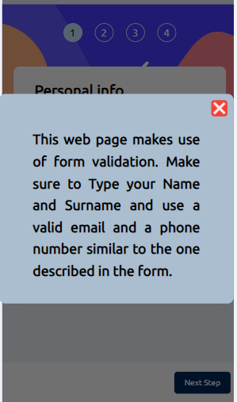
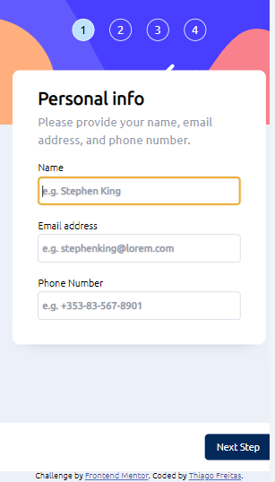
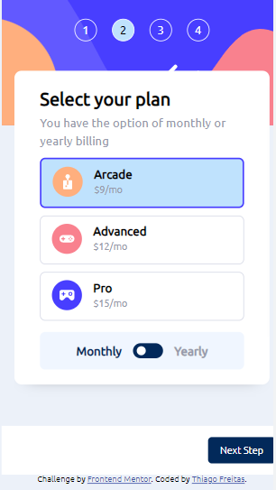
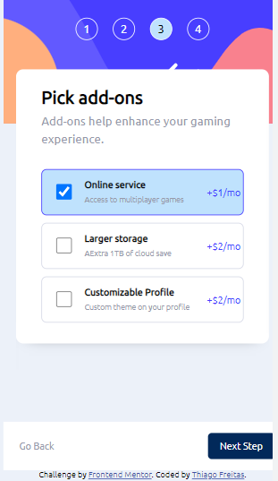
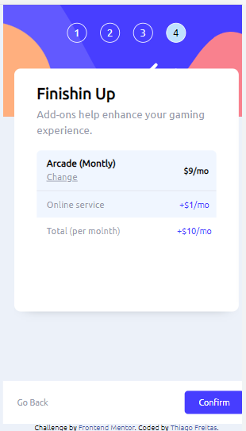
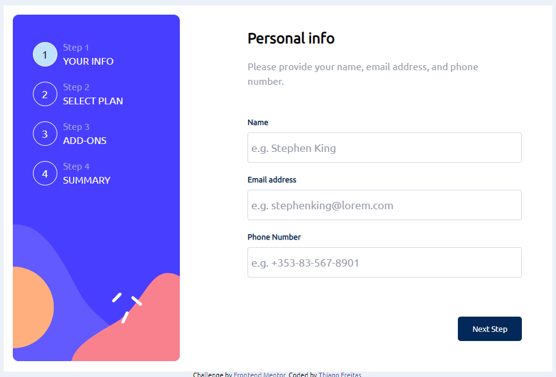
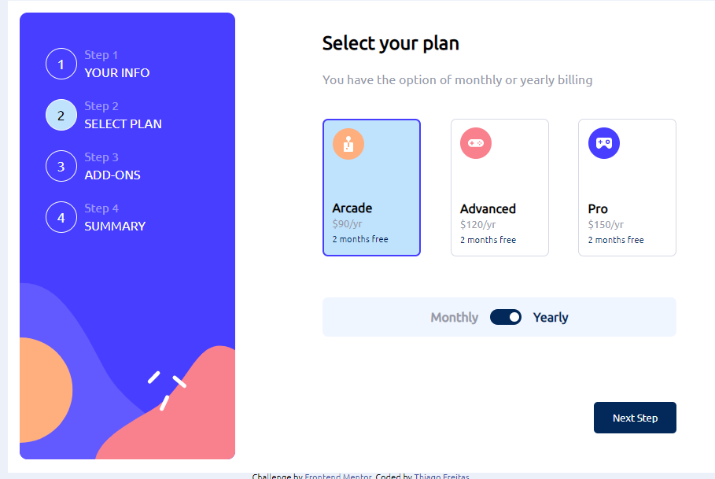
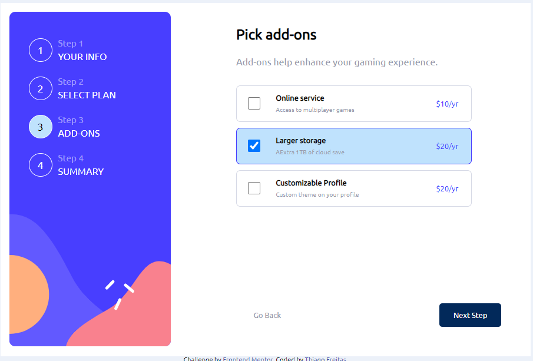
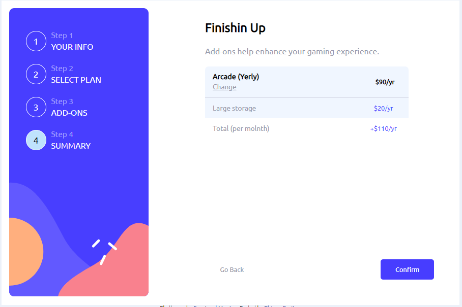
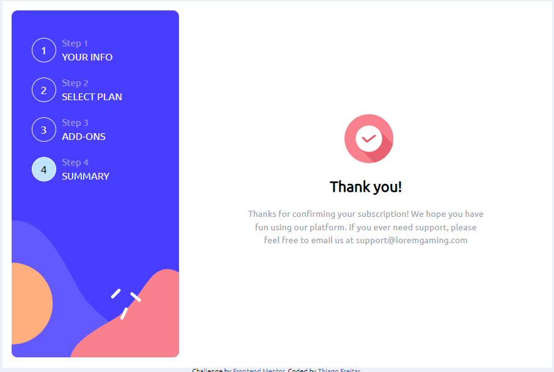

# Frontend Mentor - Multi-step form solution

This is a solution to the [Multi-step form challenge on Frontend Mentor](https://www.frontendmentor.io/challenges/multistep-form-YVAnSdqQBJ). Frontend Mentor challenges help you improve your coding skills by building realistic projects. 

## Table of contents

- [Overview](#overview)
  - [The challenge](#the-challenge)
  - [Screenshot](#screenshot)
  - [Links](#links)
- [My process](#my-process)
  - [Built with](#built-with)
  - [What I learned](#what-i-learned)
  - [Continued development](#continued-development)
- [Author](#author)
- [Acknowledgments](#acknowledgments)

**Note: Delete this note and update the table of contents based on what sections you keep.**

## Overview

### The challenge

Users should be able to:

- Complete each step of the sequence
- Go back to a previous step to update their selections
- See a summary of their selections on the final step and confirm their order
- View the optimal layout for the interface depending on their device's screen size
- See hover and focus states for all interactive elements on the page
- Receive form validation messages if:
  - A field has been missed
  - The email address is not formatted correctly
  - A step is submitted, but no selection has been made

### Screenshot
</br>

#### Mobile
</br>
<p align="center">
    
</p>
</br
><p align="center">
    
</p>
</br>
<p align="center">
    
</p>
</br>
<p align="center">
    
</p>
</br>
<p align="center">
    
</p>
</br>
</br>

#### Desktop
</br>
<p align="center">
    
</p>
</br>
<p align="center">
    
</p>
</br>
<p align="center">
    
</p>
</br>
<p align="center">
    
</p>
<p align="center">
    
</p>
</br>


### Links

- Solution URL: [Add solution URL here](https://your-solution-url.com)
- Live Site URL: [Add live site URL here](https://your-live-site-url.com)

## My process

### Built with

- Semantic HTML5 markup
- Flexbox
- CSS Grid
- Mobile-first workflow
- Java Script


### What I learned

I chose the Multi-step form challenge because it seemed to have a reasonable demand for coding. I love coding! By completing this challenge, I got to learn how to test the functionalities of the web page to prevent bugs and make sure that everything works as it is supposed to. I have decided to change the original workflow to provide the user with a better experience. First of all, Once the user writes their data and presses the Next Step button, the page will not allow going back to the form. Second of all, I let a plan already chosen as a basic plan (Arcade/mo). Finally, If the user does not choose an Add on, the page will ask them if they are sure of passing this advantage. 

<br/>
<br/>
You can check the JS code used on this page bellow:
<br/>
<br/>


```js
window.addEventListener("load", () => {
  const btn = document.querySelector(".botton > span:last-of-type");
  const form = document.querySelector("ul");
  const formLen = document.querySelectorAll("ul > li");
  const btnSection = document.querySelector(".botton");
  const btn2 = document.querySelector(".botton span:first-of-type");
  const formVal = document.querySelectorAll("form > input");
  const pagNum = document.querySelectorAll("#header  span ");
  const infoBox = document.querySelector(".print");
  const infoBoxMess = document.querySelector(".print > h3");
  const closeScreen = document.querySelector(".print > div");
  const addPrice = document.querySelectorAll(".prc1");
  const block = document.querySelector("#container > div:first-of-type");
  const planBtn = document.getElementById("btn");
  const finalPrice = document.querySelector(".prc3");
  const planBtnInside = document.querySelector(
    "#planCont > #holdBtn > #btn > div"
  );
  const monthly = document.querySelector(
    "#planCont > #holdBtn > div:first-of-type"
  );
  const yerly = document.querySelector(
    "#planCont > #holdBtn> div:last-of-type"
  );
  const price = document.querySelectorAll(".planType .txt p:nth-child(2)");
  const visible = document.querySelectorAll(".yerlyVisible");
  const planType = document.querySelectorAll(".value");
  const finalSum = document.querySelectorAll(".prc2");
  const finalChange = document.querySelector("a");
  let checBox = document.querySelectorAll(".cheBox > input");
  let checBoxDiv = document.querySelectorAll(".boxJs");
  let priceRangeYear = ["$90/yr", "$120/yr", "$150/yr"];
  let priceRangeMonth = ["$9/mo", "$12/mo", "$15/mo"];
  let priceRangeYearAdds = ["$10/yr", "$20/yr", "$20/yr"];
  let priceRangeMonthAdds = ["$1/mo", "$2/mo", "$2/mo"];
  let choseCheck = [];
  let left = 0;
  let click = 0;
  let click2 = 0;
  let mORy = "mo";
  let pickPrice = null;
  let leftL = 500;
  let steps = document.querySelectorAll(".onliDesk");
  let x = window.matchMedia("(max-width: 441px)");
  let doneResizing = null;
  let planBcolor = "Arcade";
  let last = "(Montly)";
  
  //   Information Box ===============================================

  printMessagge();
  function printMessagge(msg, num) {
    msg =
      msg ||
      "This web page makes use of form validation. Make sure to Type your Name and Surname and use a valid email and a phone number similar to the one described in the form.";
    infoBox.classList.add("message");
    block.classList.add("blockFrom");
    infoBoxMess.innerHTML = msg;
    closeScreen.onclick = () => {
      infoBox.className = "print";
      block.classList.remove("blockFrom");
      if (num != undefined) {
        formVal[num].focus();
      }
    };
  }
  // checBox
  //   Information Box ==============================================
  //   Next step and Go back buttons ================================
  (function () {
    "user strict";

    function myCheck() {
      var i = 0;
      for (i; i < checBox.length; i++) {
        if (checBox[i].checked) {
          return true;
        } else if (i == checBox.length - 1) {
          return false;
        }
      }
    }

    btn.onclick = () => {
      if (click < formLen.length - 2 && true) {
        pageNumBackGround(click, 1);
        click++;
        left += leftL;
        form.style.left = "-" + `${left}` + "px";
        if (click == formLen.length - 2) {
          btn.innerHTML = "Confirm";
          btn.style.backgroundColor = "hsl(243, 100%, 62%)";
          setFinalPrice();
        }
        if (click == 3 && !myCheck()) {
          printMessagge(
            "Are you sure you do not want to enhance your gaming experience?"
          );
        }
        if (click >= 2) {
          backBtn();
          btn2.style.color = "hsl(231, 11%, 63%)";
        }

        if (click > 0 && click < 2) {
          planType[0].classList.add("bcolor");
          pickPrice = planType[0].getAttribute("value");
          planBcolor = document.querySelector(".bcolor .txt p:first-of-type");
        }
      } else if (click > 0 && click < formLen.length - 1) {
        left += leftL;
        form.style.left = "-" + `${left}` + "px";
        btnSection.className = "display";
        click++;
      }
    };

    function backBtn() {
      btn2.addEventListener("click", backBtnPart2);
    }
    finalChange.onclick = (event) => {
      event.preventDefault();
      for (var i = 0; i < 2; i++) {
        backBtnPart2();
      }
    };
    function backBtnPart2() {
      if (click >= 1) {
        left = left - leftL;
        form.style.left = "-" + `${left}` + "px";
        click--;
        pageNumBackGround(click, 2);
      }
      if (click < 2) {
        btn2.style.color = "hsl(0, 0%, 100%)";
        btn2.removeEventListener("click", backBtnPart2);
      }
      if (click == 2) {
        btn.innerHTML = "Next Step";
        btn.style.backgroundColor = "hsl(213, 96%, 18%)";
      }
    }
  })();
  function pageNumBackGround(cllickNum, call) {
    switch (call) {
      case 2:
        if (cllickNum == 2) {
          pagNum[cllickNum + 1].classList = "pNum";
          pagNum[cllickNum].classList.add("pageNum");
        } else if (cllickNum >= 0) {
          pagNum[cllickNum + 1].classList = "pNum";
          pagNum[cllickNum].classList.add("pageNum");
        }
        break;

      default:
        if (cllickNum == 0) {
          pagNum[cllickNum].classList = "pNum";
          pagNum[cllickNum + 1].classList.add("pageNum");
        } else {
          pagNum[cllickNum].classList = "pNum";
          pagNum[cllickNum + 1].classList.add("pageNum");
        }
    }
  }
  //  End of  Next step and Go back buttons ================================
  //  Form Validation ======================================================
  function formValidation() {
    if (click > 0) {
      return true;
    }
    var emp = [];
    for (var i = 0; i < formVal.length; i++) {
      if (formVal[i].value == "") {
        emp.push(formVal[i].value);
      }
    }
    empty();
    function empty() {
      if (
        formVal[0].value == "" &&
        formVal[1].value == "" &&
        formVal[2].value == ""
      ) {
        printMessagge("Make sure to fill in the form.");
      } else {
        checkEmpty();
      }
    }
    function checkEmpty() {
      for (var i = 0; i < formVal.length; i++) {
        if (formVal[i].value == "") {
          printMessagge(
            "Make sure to fill in your " + formVal[i].name + ".",
            i
          );
          break;
        }
      }
    }
    function checkName() {
      value = formVal[0].value;
      var condition = value.indexOf(" ") < 0;
      if (!condition) {
        return true;
      } else {
        printMessagge("Make sure to fill in Your Name and Surname.", 0);
      }
    }
    function checkEamil() {
      value = formVal[1].value;
      const pass = value.match(/^\w+([\.-]?\w+)*@\w+([\.-]?\w+)*(\.\w{2,3})+$/);
      if (pass) {
        return true;
      } else {
        printMessagge("Make sure to enter a valid email.", 1);
      }
    }
    function checkNumber() {
      valueExp = new RegExp(
        "^\\+[3]{1}[5]{1}[3]{1}-[0-9]{2}-[0-9]{3}-[0-9]{4}$"
      );
      if (valueExp.test(formVal[2].value)) {
        return true;
      } else {
        printMessagge("Make sure to enter a valid Phone Number.", 2);
      }
    }
    if (emp.length == 0) {
      if (checkName() && checkEamil() && checkNumber()) {
        return true;
      }
    }
  }
  //  End of Form Validation ======================================================
  //  Plans Type (month or Year)===================================================
  planBtn.onclick = () => {
    for (var i = 0; i < planType.length; i++) {
      planType[i].classList.remove("bcolor");
    }
    choseCheck = [];
    checBox.forEach((box) => {
      box.checked = false;
    });
    checBoxDiv.forEach((box) => {
      let atrr = box.getAttribute("value");
      let atrrName = document.getElementById(atrr);
      let disp = document.querySelector("." + atrrName.name);
      disp.classList.add("display");
      box.classList.remove("dcolor");
    });
    if (click2 == 0) {
      planBtnInside.classList.add("transEfect");
      monthly.classList.add("color");
      yerly.classList.remove("color");
      visible.forEach((p) => {
        p.style.display = "block";
      });
      changePrice();
    }
    function changePrice() {
      let prcs = [];
      let prcsAdd = [];
      let prcTimes = 0;
      switch (click2) {
        case 0:
          prcs = priceRangeYear;
          prcsAdd = priceRangeYearAdds;
          prcTimes = 10;
          mORy = "yr";
          last = "(Yerly)";
          break;
        default:
          prcs = priceRangeMonth;
          prcsAdd = priceRangeMonthAdds;
          prcTimes = 0.1;
          mORy = "mo";
          last = "(Montly)";
      }
      for (var i = 0; i <= 2; i++) {
        price[i].innerHTML = prcs[i];
        addPrice[i].innerHTML = prcsAdd[i];
        finalSum[i].innerHTML = prcsAdd[i];
        planType[i].setAttribute(
          "value",
          planType[i].getAttribute("value") * prcTimes
        );
        checBox[i].setAttribute(
          "value",
          checBox[i].getAttribute("value") * prcTimes
        );
      }
    }
    if (click2 == 1) {
      planBtnInside.classList.remove("transEfect");
      monthly.classList.remove("color");
      yerly.classList.add("color");
      visible.forEach((p) => {
        p.style.display = "none";
      });
      changePrice();
    }
    click2++;
    if (click2 == 2) click2 = 0;
    planType[0].classList.add("bcolor");
    pickPrice = planType[0].getAttribute("value");
    planBcolor = document.querySelector(".bcolor .txt p:first-of-type");
  };

  (function () {
    "user strict";
    planType.forEach((plan) => {
      plan.addEventListener("click", function () {
        for (var i = 0; i < planType.length; i++) {
          planType[i].classList.remove("bcolor");
        }
        pickPrice = this.getAttribute("value");
        plan.classList.add("bcolor");
        planBcolor = document.querySelector(".bcolor .txt p:first-of-type");
      });
    });
  })();
  //  End of Plans Type (month or Year)=====================================
  //  Chebox     ===========================================================
  (function () {
    "user strict";
    checBoxDiv.forEach((box) => {
      box.addEventListener("click", function () {
        let atrr = this.getAttribute("value");
        let atrrName = document.getElementById(atrr);

        if (atrrName.checked == false) {
          document.getElementById(atrr).checked = true;
          choseCheck.push(atrrName.value);
          box.classList.add("dcolor");
          let disp = document.querySelector("." + atrrName.name);
          disp.classList.remove("display");
        } else {
          document.getElementById(atrr).checked = false;
          box.classList.remove("dcolor");
          let disp = document.querySelector("." + atrrName.name);
          disp.classList.add("display");
          choseCheck.splice(choseCheck.indexOf(atrrName.value), 1);
        }
      });
    });
  })();
  function setFinalPrice() {
    let finalPlan = document.querySelector("#arcade");
    finalPlan.innerHTML = planBcolor.innerHTML + " " + last;
    finalPrice.innerHTML = "&nbsp $" + `${pickPrice}` + "/" + mORy;
    const total = choseCheck.reduce((currentTotal, item) => {
      return Number(item) + currentTotal;
    }, 0);
    finalSum[3].innerHTML = "+$" + `${total + Number(pickPrice)}` + "/" + mORy;
  }
  //  End of Chebox ======================================================
  //======================= Mobile Version =================================
  this.window.addEventListener("resize", function () {
    this.clearTimeout(doneResizing);
    doneResizing = this.setTimeout(function () {
      responsive(x);
    }, 100);
  });
  responsive(x);
  function responsive(maxWidth) {
    if (maxWidth.matches) {
      displayTxt("none");
      leftL = 350;
      resizing();
    } else {
      displayTxt("block");
      leftL = 500;
      resizing();
    }
  }
  function resizing() {
    left = click * leftL;
    form.style.left = "-" + click * leftL + "px";
  }
  function displayTxt(dis) {
    steps.forEach((step) => {
      step.style.display = dis;
    });
  }
  this.clearTimeout(doneResizing);
});

}
```


### Continued development

It is well known that working with dates and strings is not a simple task. It demands the good expertise of the programmer. It is much simpler to perform form validation using the functionalities of HTML 5 (required). However, programming a form validation using a programming language gives more control over what is required from the user. By having to identify the characters typed by the user, I realize the necessity to increase my knowledge of understading regular expressions better. The next step is to get a better grasp of it.


## Author

- Github - [Thiago Ando de Freitas](https://github.com/ThiagoAndo)
- Frontend Mentor - [@ThiagoAndo](https://www.frontendmentor.io/profile/ThiagoAndo)
- Alive Website - [multi-step-form-main](https://thiagoando.github.io/multi-step-form-main/)


